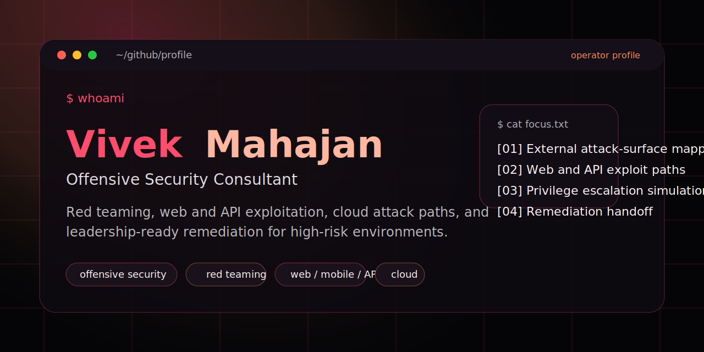

# Vivek Mahajan

<p align="center">
  
</p>

<p align="center">
  <strong>Offensive Security Consultant</strong>
  <br />
  Red teaming, exploit-path analysis, web and API security, cloud attack paths, and remediation that holds up with both engineers and leadership.
</p>

<p align="center">
  <a href="https://shadowsec.live">Website</a>
  ·
  <a href="https://shadowsec.live/blog">Writeups</a>
  ·
  <a href="https://shadowsec.live/certifications">Certifications</a>
  ·
  <a href="https://www.linkedin.com/in/c3p70r/">LinkedIn</a>
  ·
  <a href="https://app.hackthebox.com/public/users/56986">Hack The Box</a>
</p>

## About

```text
base        Singapore
experience  11+ years
focus       red teaming | web / mobile / API security | cloud security | AI red teaming
coverage    fintech | government | trading | healthcare | SaaS
```

I work on adversary-aligned assessments, exploit validation, operator tooling, and remediation plans that are precise enough for engineers and clear enough for leadership.

## What I Do

- Run red team operations and attack-path simulations against realistic business targets
- Test web, mobile, API, and cloud environments with an exploitation-first mindset
- Build custom tooling to accelerate research and offensive workflows
- Turn technical findings into prioritized remediation guidance

## Selected Writeups

| Report | Platform | Notes |
| --- | --- | --- |
| [Barrier](https://shadowsec.live/blog/vulnlab-barrier-writeup/) | VulnLab | Hard-box methodology and escalation-oriented notes |
| [CCTV](https://shadowsec.live/blog/cctv/) | Hack The Box | Sanitized public summary |
| [Interpreter](https://shadowsec.live/blog/interpreter/) | Hack The Box | Redacted exploitation workflow |
| [WingData](https://shadowsec.live/blog/wingdata/) | Hack The Box | Operator notes and attack-surface triage |
| [Facts](https://shadowsec.live/blog/facts/) | Hack The Box | Public field notes and methodology |

## Certifications

| Credential | Area |
| --- | --- |
| OSWE | Advanced web exploitation |
| OSCE | Offensive tradecraft |
| OSCP | Penetration testing |
| Burp Suite Certified Practitioner | Application testing depth |
| CRTO / CARTS / CGRTS | Red team and cloud operations |

## Stack

`Burp Suite` `Python` `Bash` `PowerShell` `AWS` `Azure` `Linux` `Active Directory` `Nuclei`
